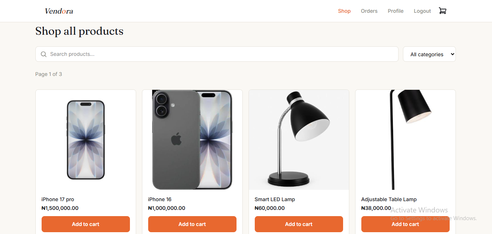
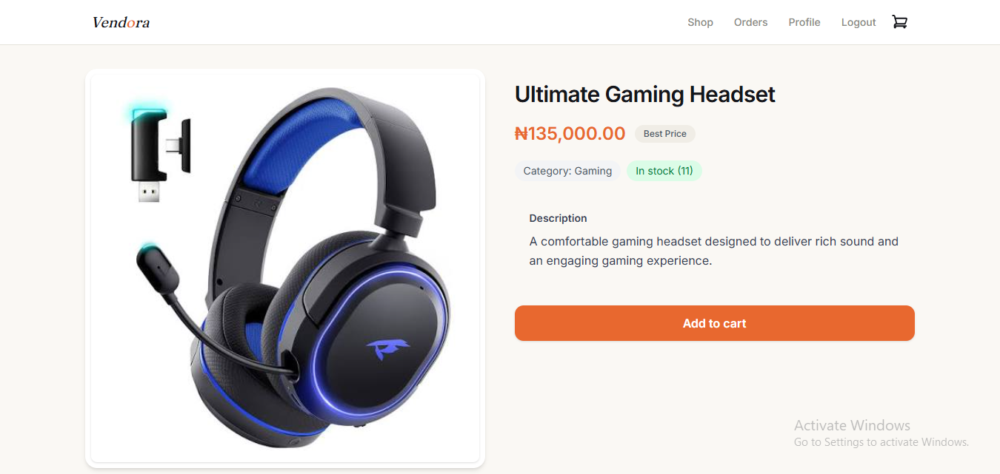
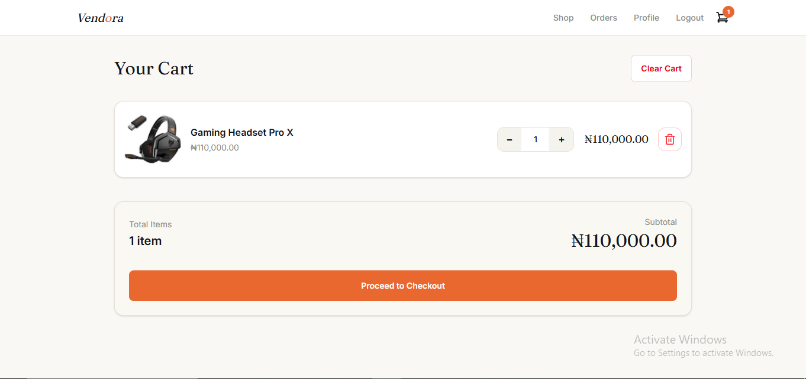
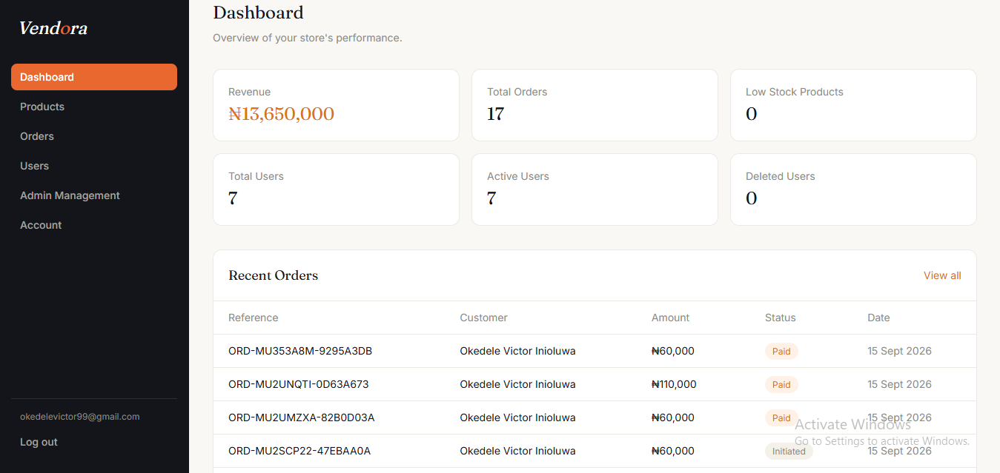
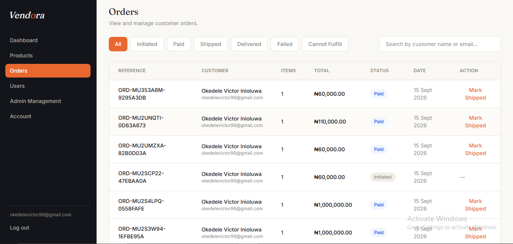

# 🛒 Vendora — Full-Stack E-Commerce Platform

Vendora is a production-style full-stack e-commerce platform built with **React, TypeScript, Node.js, Express, and MongoDB**, featuring payments, inventory management, transactional email, and role-based administration.

## 🔗 Links

* 🌐 **Live Demo:** [Visit Vendora](https://vendora-one-swart.vercel.app/)
* 💻 **GitHub:** [View Repository](https://github.com/okedelevictor99-dev/Vendora)

> **Payment:** Paystack is currently in test mode. No real money is charged.

---

## 🧰 Tech Stack

**Frontend:** React 19, TypeScript, Vite, Tailwind CSS, React Router, TanStack React Query, React Hook Form, Zod, Axios

**Backend:** Node.js, Express.js, TypeScript, MongoDB, Mongoose, JWT, bcrypt

**Services:** Paystack, Brevo, Cloudinary, MongoDB Atlas

**Deployment:** Vercel, Render

**Tools:** Git, GitHub, Postman

---

## 📸 Screenshots

### Storefront



### Product Details



### Checkout



### Admin Dashboard



### Order Management



---

## ✨ Key Features

### Customer

* Registration, email verification, login, and password reset
* JWT access and refresh token authentication
* Product search and filtering
* Cart and checkout
* Paystack payments
* Inventory reservation
* Order history and tracking
* Profile management
* Logout from all devices

### Admin

* Dashboard with users, orders, revenue, and low-stock products
* Product and inventory management
* Order management and refunds
* User management
* Admin management
* Admin / Super Admin role-based access

---

## 🔐 Backend & Security

* JWT access/refresh token architecture
* Role-based authorization
* Password hashing with bcrypt
* Persistent refresh tokens
* Request validation
* Rate limiting
* CORS configuration
* Protected API routes
* Centralized error handling
* Logout from all devices

---

## 💳 Payments & Inventory

Vendora integrates **Paystack** with server-side transaction verification and webhook processing.

```text
Checkout
   ↓
Stock Reservation
   ↓
Paystack Payment
   ↓
Verification
   ↓
Order Confirmation
```

Expired or unsuccessful reservations can be released through scheduled processing.

---

## 📧 Transactional Email

**Brevo** handles:

* Account verification
* Password reset
* Order confirmation
* Shipping and delivery notifications
* Refund notifications
* Admin invitations

---

## 🏗️ Architecture

Vendora uses a feature-based modular architecture.

```text
backend/
└── src/
    ├── modules/
    │   ├── client/
    │   └── admin/
    ├── config/
    ├── middlewares/
    ├── services/
    ├── utils/
    └── app.ts

frontend/
└── src/
    ├── features/
    ├── components/
    ├── pages/
    ├── api-setup/
    ├── hooks/
    └── routes/
```

**Core models:** `User` · `Admin` · `Product` · `Cart` · `Order` · `Token`

---

## 🧪 Testing

API endpoints and major workflows were manually tested with **Postman**, including authentication, protected routes, checkout, payments, orders, and admin operations.

---

## 🌐 Deployment

| Service  | Platform      |
| -------- | ------------- |
| Frontend | Vercel        |
| Backend  | Render        |
| Database | MongoDB Atlas |
| Images   | Cloudinary    |
| Email    | Brevo         |
| Payments | Paystack      |

---

## 👨‍💻 Author

**Victor Okedele**
Backend-Focused Full-Stack Developer

[GitHub](https://github.com/okedelevictor99-dev)
